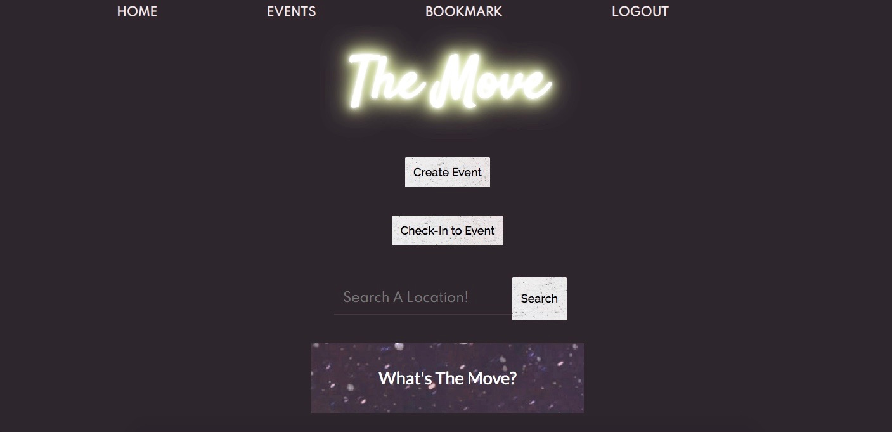
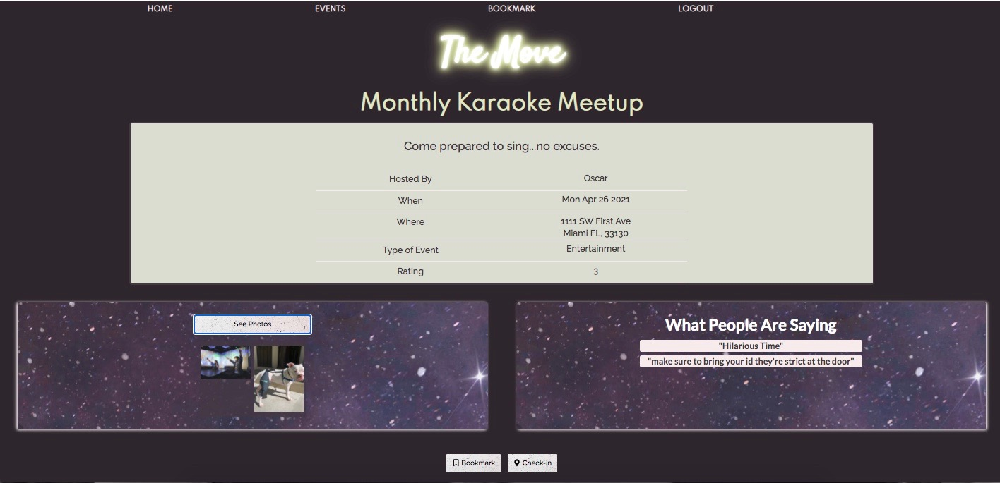

# the-move

## Description 
A simple application that allows users to explore, create and give real-time feedback on events. The user has the ability to search events happening in a specific location, or all the events in our database. Events can be bookmarked to save for later.  Additionally, if a user is at an event that is on the site they can check in to provide personalized feedabck in the form of comments, ratings and photos.

## Installation
React needs to be utilized as well as several npm packages. Run npm install in node to download all neccessary packages.

## Contributors
[Andres Fajardo](https://github.com/AFF321) 

[Gina Vargas](https://github.com/ginavargas1)

[Jennifer Vereecken](https://github.com/jbeans12)

[Chelsey Morris](http://github.com/cmorris91)

## Screenshots

# Links
Deployed:
https://radiant-harbor-61772.herokuapp.com/home

Repo:
https://github.com/cmorris91/the-move

## License 

 